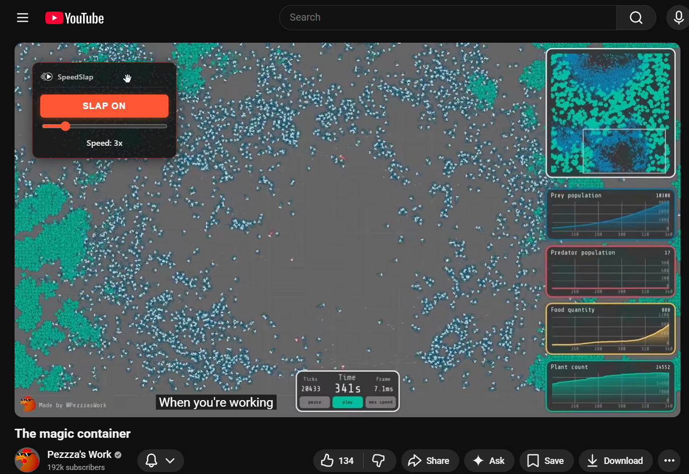
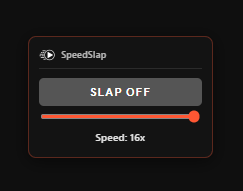
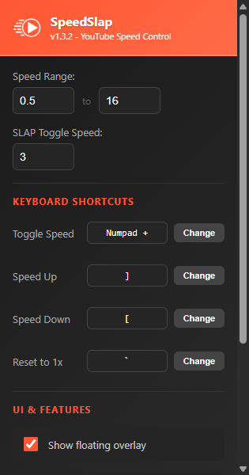
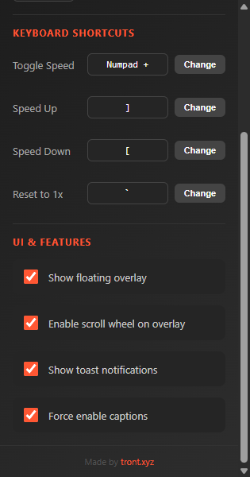

# SpeedSlap

Advanced YouTube playback speed control with customizable hotkeys, SLAP toggle, and scroll wheel support.


## Screenshots

<p align="center">
  
</p>

<br>

<p align="center">
  &nbsp;&nbsp;&nbsp;&nbsp;&nbsp;&nbsp;
  &nbsp;&nbsp;&nbsp;&nbsp;&nbsp;&nbsp;
  
</p>

<br>

## Features

- **Speed Range:** 0.5x to 16x playback (configurable, 16x is browser limit)
- **SLAP Toggle:** Quick switch between 1x and custom speed (default 3x)
- **Customizable Hotkeys:** Rebind all keyboard shortcuts with modifier support
- **Scroll Wheel Control:** Adjust speed by scrolling on the overlay
- **Draggable Overlay:** Floating control panel with position persistence
- **Auto-Hide:** UI fades out after 2 seconds of inactivity
- **Auto Captions:** Automatically enables English captions
- **Speed Persistence:** Last used speed saved and restored on page reload
- **Modern UI:** Dark theme with accent colors throughout

## Keyboard Shortcuts

All shortcuts are customizable in the extension popup. Defaults:

| Key | Action |
|-----|--------|
| `Numpad +` | Toggle speed ON/OFF |
| `` ` `` (backtick) | Reset to 1x |
| `]` | Increase speed by 0.5x |
| `[` | Decrease speed by 0.5x |
| `Shift + ]` | Fine increase by 0.1x |
| `Shift + [` | Fine decrease by 0.1x |

**Note:** Shortcuts don't fire when typing in input fields (comments, search, etc.)

## Scroll Wheel Control

Hover over the speed overlay and scroll:
- **Scroll up** - Increase speed by 0.5x
- **Scroll down** - Decrease speed by 0.5x
- **Shift + scroll** - Fine adjust by 0.1x

Can be disabled in settings.

## Installation

### From Source
1. Download/clone this repository
2. Open Chrome and go to `chrome://extensions/`
3. Enable **Developer mode** (toggle in top right)
4. Click **Load unpacked**
5. Select the folder

### From Release
1. Download the latest `.zip` from Releases
2. Extract the folder
3. Follow steps 2-5 above

## Usage

1. Navigate to any YouTube video
2. Floating control panel appears (top-left by default)
3. Drag to reposition, click SLAP to toggle speed, or use slider
4. Use keyboard shortcuts for hands-free control
5. Click extension icon to customize settings

## File Structure

```
SpeedSlap/
├── manifest.json      # Extension config (Manifest V3)
├── content.js         # Main logic - UI, speed control, hotkeys
├── injected.js        # Caption injection (page context)
├── background.js      # Service worker
├── popup.html         # Settings UI
├── popup.js           # Settings handler with key recording
├── app_icon.png       # Extension icon
├── index.html         # Landing page
├── README.md          # This file
├── TODO.md            # Roadmap & changelog
└── ICON/              # Icon generator tool
```

## Settings

Click the extension icon to configure:

- **Speed Range** - Min and max playback speeds
- **SLAP Toggle Speed** - Speed when toggling ON
- **Keyboard Shortcuts** - Customize all hotkeys
- **Show Overlay** - Toggle the floating control panel
- **Scroll Wheel** - Enable/disable scroll wheel control on overlay
- **Show Toasts** - Toggle toast notifications
- **Force Captions** - Auto-enable English captions

Settings apply immediately to any open YouTube tabs.

## Changelog

### v1.3.2 (2026-02-02)
- Overlay now updates live when settings change (no refresh needed)

### v1.3.1 (2026-02-02)
- Autosave - settings save automatically on change, no button needed
- Max speed capped at 16x (browser HTML5 video limit)

### v1.3 (2026-02-02)
- Toggle for floating overlay visibility
- Toggle for toast notifications
- Toggle for force-enable captions
- Beefed up settings popup with new "UI & Features" section

### v1.2 (2026-02-02)
- Rebranded to **SpeedSlap**
- Customizable keyboard shortcuts with modifier support
- New reset hotkey (backtick)
- Scroll wheel speed control on overlay
- Input field protection (shortcuts don't fire when typing)
- New custom icon
- Redesigned popup with branding
- Redesigned overlay with icon header
- Toast notifications with icon
- Landing page with animated icon

### v1.1 (2026-02-02)
- Settings now functional
- Configurable speed range and toggle speed
- Live settings sync across tabs
- Dark theme popup

### v1.0 (Initial)
- Draggable speed control overlay
- Keyboard shortcuts
- Auto-hide, position/speed persistence
- Auto caption enable

## Links

- **Landing Page:** [tront.xyz/speedslap](https://tront.xyz/speedslap/)
- **Blog Post:** [tront.xyz/blog - SpeedSlap v1.2](https://tront.xyz/blog/posts/speedslap-chrome-extension/)
- **Releases:** [GitHub Releases](https://github.com/TrentSterling/speedslap/releases)

## Author

**Trent Sterling** - [tront.xyz](https://tront.xyz)

## License

MIT License - feel free to modify and distribute.
